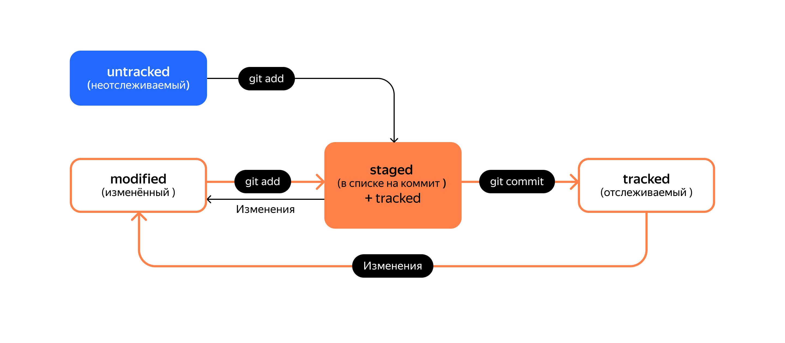

# Основные команды Git 

  
  
__`git init`__ создание в текущей директории Репозитория git  
__`git clone https://github.com/PraktikumJava/git-hints.git`__ клонирование репозитория  
__`git remote add <name> <https://github.com/%ИМЯ_АККАУНТА%/%ИМЯ_ПРОЕКТА%>`__ связывание локального репозитория с созданным на GitHub репозиторием. Обычно `<name>` это _origin_. Ссылку на репозиторий надо получить. Например предварительно создать его на github.com  
__`git status`__ получить информацию о состоянии репозитория. На какой ветке находимся, есть ли изменённые файлы и файлы, готовые к коммиту  
__`git log`__ история коммитов  
__`git log --oneline`__ вывод истории коммитов краткой строкой. Сокращаются в том числе и длины хэшей коммитов  
__`git commit --amend`__ внести исправления в **крайний** коммит. Порядок действий такой:  
- совершили преждевременный коммит `git commit -m "ЗФ 1.0"`  
- обнаружили забытое. Вносим изменения и `git add new_file.c`  
- подправляем крайний коммит `git commit --amend --no-edit`  
С опцией `--no-edit` будет применём комментарий из оригинального коммита.  

